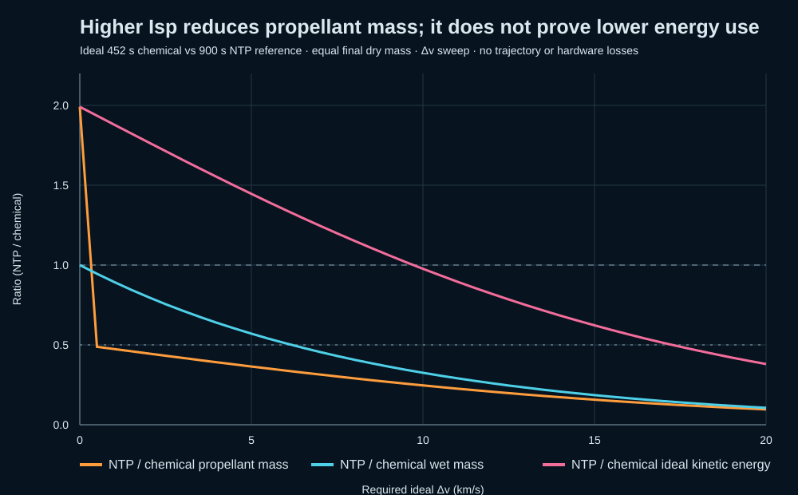

# AETHER-1: propulsion concept and claim audit

An editable Blender concept for a hydrogen-fed nuclear-thermal rocket, paired with a reproducible first-principles comparison against a high-performance chemical reference.

## Finding

The Blender model does **not** prove a 50% energy saving. It is visual geometry plus a stylized exhaust animation. The analysis below deliberately separates propellant mass from energy.

For an illustrative ideal comparison, this repository uses a 452 s vacuum-Isp chemical reference (NASA's Space Shuttle Main Engine) and a 900 s nuclear-thermal propulsion (NTP) reference/target discussed in NASA studies. At a 4 km/s ideal maneuver, assuming equal final dry mass and no gravity, drag, finite-burn, tankage, engine-mass, or conversion losses, the calculation gives:

| Metric, NTP relative to chemical | Ideal result |
| --- | ---: |
| Propellant mass | **60.88% less** |
| Wet mass (same final dry mass) | **36.19% less** |
| Vehicle-plus-exhaust kinetic-energy output | **55.11% more** |

The first result supports a conditional **propellant-mass** hypothesis. The third result directly contradicts a general claim of “50% less energy” at this maneuver size. Under this ideal model, the NTP kinetic-energy output first reaches 50% below the reference at about **17.27 km/s**. That is still not proof of real reactor or chemical source-energy use: conversion efficiency and full vehicle design are not modeled.

NASA explains that the ideal rocket equation links Δv, effective exhaust velocity, and mass ratio; NASA also describes NTP as having potential near twice the specific impulse of the best chemical engines. Those facts support the direction of the propellant-mass argument, not a universal energy-saving percentage. See the [equation derivation](research/theory.md) and [source register](research/sources.md).

## Repository contents

- `model/AETHER-1.blend` — editable Blender scene; 120-frame looping flame animation. Press Spacebar to play.
- `model/AETHER-1_concept.png` — firing-frame render.
- `model/build_aether1.py` — scene-generation script.
- `model/AETHER-1_design-note.md` — short model scope note.
- `research/` — assumptions, derivation, evidence register, and a validation plan.
- `analysis/ideal_comparison.py` — standard-library Python calculation; regenerates the CSV and SVG.
- `data/ideal_comparison.csv` — 0.5–20 km/s sweep.
- `analysis/ideal_comparison.svg` — chart of the ideal ratios.



## Reproduce the calculation

The script uses Python's standard library only:

```powershell
python analysis/ideal_comparison.py
```

It writes `data/ideal_comparison.csv` and `analysis/ideal_comparison.svg`. The CSV records every assumption-derived result rather than hiding the model in a spreadsheet.

## Scope and status

This is an analytical screening exercise, not a validated engine design, mission closure, reactor model, or energy audit. “Normal rocket” is not a defined engineering baseline, so the 452 s / 900 s comparison is stated explicitly and should not be generalized to every rocket or mission. NTP is an in-space thermal propulsion concept; this Blender exterior is not flight hardware and contains no reactor internals.

The main result is therefore **conditional and reproducible**, not a claim that AETHER-1 achieves any measured performance. See [`research/claim_assessment.md`](research/claim_assessment.md) before repeating the headline numbers.
